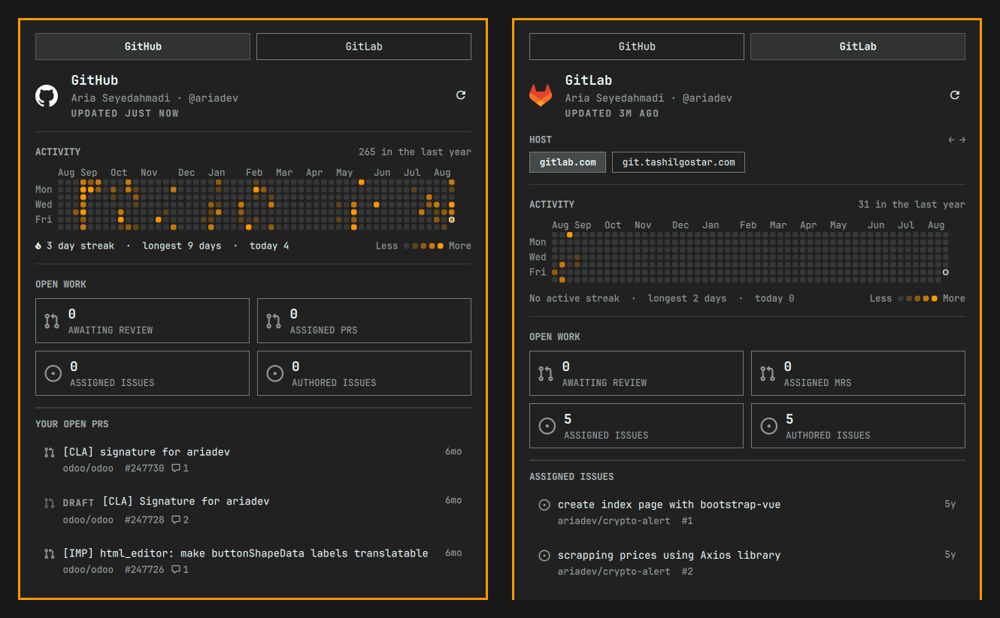

# dev.git — Git dashboard bar widget for Omarchy

A native [Omarchy](https://omarchy.org) shell bar widget that watches GitHub and
GitLab for open work: a full-year contribution graph, review queues, and your
own pull and merge requests, all in one panel.



## Features

- **Full-year activity graph** — the trailing 53 weeks, quartile-shaded, with
  per-day tooltips, month and weekday axes, current/longest streak and today's
  count
- **One tab per provider** — the tabs read `GitHub` and `GitLab`, never a
  hostname; multiple hosts live in a host switch inside the tab
- **Multiple hosts per provider** — GitHub Enterprise and self-managed GitLab
  instances are discovered from `gh` and `glab` config, each with its own
  identity, graph and queues. The panel opens on a signed-in host and shows the
  exact sign-in command for the ones that aren't.
- A grid of open-work counts: awaiting review, assigned PRs/MRs, assigned
  issues, authored issues — each click opens the pre-filtered queue page
- Queue lists with per-row state: draft tag, approval check, comment count,
  repository, number and age
- A dot on the bar icon when something is waiting on your review
- Keyboard driven throughout (see below)

## Requirements

- `curl` and `jq` — the collector is built on them
- [gh](https://cli.github.com/) authenticated with `gh auth login`
- [glab](https://gitlab.com/gitlab-org/cli) authenticated with `glab auth login`

Nothing is compiled or installed: clone the plugin and it runs. Both CLIs are
optional — GitHub and each GitLab host are collected independently, so a
missing or unauthenticated provider never hides the others.

## Install

```bash
omarchy plugin add https://github.com/ariadev/omarchy-dev-git.git --enable --yes
```

Or clone into your config by hand and enable it:

```bash
omarchy plugin enable dev.git
omarchy bar put dev.git --after omarchy.agents
```

## Keyboard

| Key           | Action                          |
|---------------|---------------------------------|
| `j` / `k`     | Move down / up the queue rows   |
| `h` / `l`     | Previous / next provider tab    |
| `[` / `]`     | Previous / next host            |
| `g` / `G`     | First / last row                |
| `Enter`       | Open the selected row           |
| `r`           | Refresh now                     |
| `Tab`         | Switch to the neighbouring panel|
| `Esc`         | Close                           |

Left click toggles the panel, middle click cycles providers, right click
refreshes.

## How it works

The widget runs the collector in `bin/gitwork` on a timer (default every 300 s)
and reads the JSON it writes to `~/.local/state/omarchy/git/overview.json`.

The collector is `bin/gitwork`, a bash script with its JSON transforms in
`bin/gitwork.jq`. Nothing is compiled or installed: clone the plugin and it
runs. It never stores a token of its own — it asks `gh auth token` /
`glab config get token` for the credentials you already authenticated with,
then talks to each API directly with `curl`.

- **GitHub** — one GraphQL request per host covers identity, the contribution
  calendar and all five open-work queues.
- **GitLab** — one GraphQL request for identity and the merge-request queues,
  REST for issues, and the events feed for the contribution calendar (GitLab
  has no calendar API). Page one of the feed reports the page count, so the
  rest are fetched concurrently.

Every host is collected in its own subshell and lands in its own temp file, so
a run costs the slowest single host rather than the sum of all of them, and one
unreachable instance never hides the others — it just carries its own sign-in
hint into the panel. When a host cannot be reached, its last good record is
carried forward for up to six hours and marked stale, so a dropped VPN does not
blank a working dashboard. An authentication failure is not carried: that data
is genuinely gone.

## Tests

```bash
./tests/run.sh
```

No network or credentials required — every host the suite touches is
deliberately unreachable.

## Settings

| Key                         | Type    | Default | Description                       |
|-----------------------------|---------|---------|-----------------------------------|
| `refreshIntervalSec`        | integer | 300     | Collector run interval in seconds |
| `providers.github.enabled`  | boolean | true    | Show the GitHub tab               |
| `providers.gitlab.enabled`  | boolean | true    | Show the GitLab tab               |

## License

MIT
